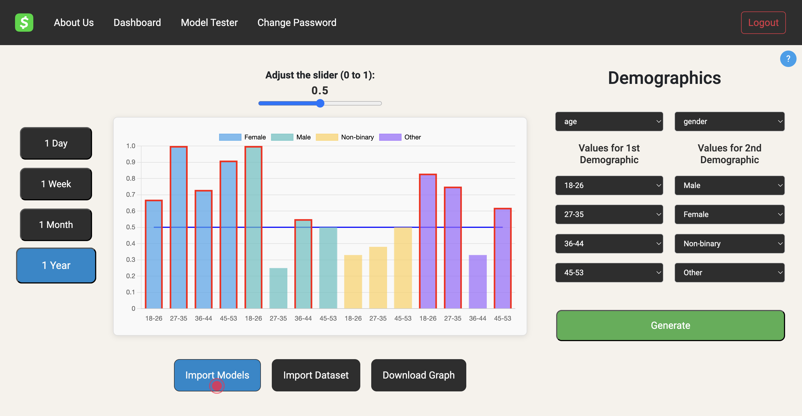

# Bias Detection and Visualization Tool - CashApp

[](https://app.netlify.com/sites/cash-app-bias-busters/deploys)
[](https://www.python.org/)
[](https://reactjs.org/)
[](https://www.mysql.com/)
[](https://flask.palletsprojects.com/)
[](https://opensource.org/licenses/MIT)

<div style="text-align: center;">
  
</div>

As part of the 2024 cohort of the Technology Leadership Initiative, we developed a platform in collaboration with **Cash App** to assist machine learning engineers in identifying and visualizing biases in their models.

- Users can upload their transaction data and approval models, which are processed by a Flask-based backend utilizing the Fairlearn library to detect biases.
- The results are intuitively visualized on the frontend using dynamic charts powered by Chart.js.
- The platform allows users to select key demographic categories such as gender, age, and race and further refine these by specifying subcategories (e.g., age ranges like 18–25).
- Additionally, users can upload multiple models to compare biases across different demographic categories and models, providing a comprehensive understanding of their systems' performance and fairness.
- Built with a focus on clean architecture, the platform ensures a modular and maintainable design with extensive testing coverage.

<div style="text-align: center;">
  
</div>

## Index

1. [Title](#bias-detection-and-visualization-tool)  
2. [Problem Statement](#problem-statement)  
3. [Motivation](#motivation)  
4. [Features](#features)  
5. [Technical Implementation Details](#technical-implementation-details)  
6. [How to Run](#how-to-runuse)  
7. [Contributors](#contributors)  
8. [Feedback and Contributions](#feedback-and-contributions)  
9. [System Requirements](#system-requirements)  
10. [Repository Structure](#repository-structure)  
11. [Acknowledgements/Credits](#acknowledgementscredits)


## Problem Statement

Ensuring fairness in AI systems is a critical challenge for organizations like Cash App, especially when decisions impact individuals based on sensitive demographic factors such as age, gender, and race. Without intuitive tools, identifying and addressing biases in transaction approval models becomes a complex and time-intensive task for machine learning engineers, potentially leading to unfair or discriminatory outcomes.

## Motivation

With the increasing integration of AI systems in sensitive applications like financial transactions, ensuring fairness and mitigating biases is crucial. This project addresses the need for tools that allow ML practitioners to identify and visualize potential biases in their models, thus enabling informed decisions to improve fairness in AI.

Our backend analyzes the bias in the selected demographic categories using the Fairlearn library. The results are visualized in intuitive, easy-to-understand graphs created using Chart.js on the frontend.

## Features

- <b>Bias Analysis:</b> Detect bias in transaction approval models for selected demographic categories using the Fairlearn library.
- <b>Interactive Dashboard:</b> User-friendly interface to import data and select demographic groups.
- **User Data Storage**: All user-uploaded data is securely stored in a MySQL database hosted on Aiven.

- <b>Visualizations:</b> Generate intuitive graphs and charts using Chart.js for detailed insights.

- <b>Model Comparison:</b> Easily compare fairness metrics across different models.

- **Login/Sign-up and Account Management**: Secure user authentication and account management to ensure data privacy and personalized access.

## Technical Implementation Details

- **Backend**: Built using Python with the Flask framework, the backend handles data processing and bias detection. Hosted on **Render**.

  - **Packages Used**:
    - `numpy`: For numerical computations and matrix operations used in model analysis.
    - `pandas`: For handling and preprocessing data.
    - `scikit-learn`: For building and training the machine learning models.
    - `scipy`: For advanced statistical computations required in analysis.
    - `mysql-connector`: To establish a connection with the MySQL database and execute queries.
    - `pytest`: For unit testing the backend to ensure robust and error-free functionality.

- **Frontend**: Built using React and Vite, the frontend is responsible for the interactive dashboard and visualizations. Hosted on **Netlify**.

  - **Packages Used**:
    - `react-joyride`: To implement an onboarding tutorial that guides first-time users with step-by-step instructions on using the platform.
    - `sweetalert2`: For displaying elegant and customizable alerts, such as login prompts or error messages.
    - `axios-retry`: To automatically retry failed API requests to the backend, ensuring smooth user experience even under intermittent connectivity.

- **Database**: We use **MySQL** to store all the data uploaded by users. The database is hosted on **Aiven**.

- **Fairlearn**: This Python library is used for detecting and assessing fairness in ML models.

- **Chart.js**: Used to render dynamic and interactive graphs and charts to visualize bias metrics.

- **Clean Architecture**:  
  The project follows a **Clean Architecture** approach, organizing the system into separate layers such as presentation, business logic, and data access. This ensures modularity, maintainability, and scalability of the application.

  - **Testing**:  
    We use **pytest** for unit and integration testing. Pytest helps ensure the correctness of the application’s logic by automating tests for backend functionality, database interactions, and model processing.

## How to run/use

If you want to use the project, simply visit the publicly hosted website: [https://cash-app-bias-busters.netlify.app](https://cash-app-bias-busters.netlify.app).

The backend is hosted on render and can be accessed through the publicly available link [https://cash-app-bias-busters.onrender.com](https://cash-app-bias-busters.onrender.com)

**NOTE:** the backend may take up to a minute to start up on the first visit.
.

If you'd like to run it locally instead, follow these steps:

### Clone the repository:

```
git clone https://github.com/Jai0212/Cash-App-Bias-Busters.git
```

### Backend:

```
pip install -r requirements.txt
cd backend
python3 -m app.controllers.app
```

### Frontend

```
cd frontend
npm run dev
```


## System Requirements

- **Operating System**: Windows/Linux/MacOS  
- **Python**: Version 3.7 or above  
- **Node.js**: Version 14 or above  
- **MySQL**: Any compatible version

## Repository Structure

```plaintext
Bias-Detection-and-Visualization-Tool/
├── .github/
│   └── workflows/          # CI/CD pipeline configuration
├── .idea/                  # IDE project files (e.g., for IntelliJ or PyCharm)
├── backend/                # Backend implementation (Flask)
├── database/               # Database schema and SQL scripts
├── frontend/               # Frontend implementation (React)
│   └── assets/             # (Images, CSS, etc.)
├── node_modules/           # Node.js dependencies
├── .DS_Store               # MacOS specific file for folder structure cache
├── .gitignore              # Git ignore file
├── LICENSE.txt             # License file
├── README.md               # Project documentation
├── armagan-TLI07-DB1-CSS/  # CSS for frontend (dashboard styling)
├── file.csv                # Sample data for testing
├── invalid_file.txt        # Sample invalid data for testing
├── model.pkl               # Saved model for predictions
├── package-lock.json       # Locks dependencies for Node.js
├── package.json            # Node.js dependencies and scripts
└── test_model.pkl          # Test model for validation
```

## Contributors
<a href="https://github.com/Jai0212/Cash-App-Bias-Busters/graphs/contributors">

</a>

## Feedback and Contributions

We welcome your feedback and contributions! Here's how you can contribute:  

1. **Report Issues**: Found a bug? Open an issue [here](https://github.com/Jai0212/Cash-App-Bias-Busters/issues).  
2. **Suggest Enhancements**: Propose new features or improvements via issues or discussions.  
3. **Fork and Contribute**:  
   - Fork this repository.  
   - Create a new branch: `git checkout -b feature-branch-name`.  
   - Commit your changes: `git commit -m "Description of changes"`.  
   - Push the branch: `git push origin feature-branch-name`.  
   - Open a pull request.


## Acknowledgements/Credits

1. This project makes use of the Fairlearn library for bias detection and fairness assessments.

```
@misc{weerts2023fairlearn,
      title={Fairlearn: Assessing and Improving Fairness of AI Systems},
      author={Hilde Weerts and Miroslav Dudík and Richard Edgar and Adrin Jalali and Roman Lutz and Michael Madaio},
      journal={Journal of Machine Learning Research},
      year={2023},
      volume={24},
      number={257},
      pages={1--8},
      url={http://jmlr.org/papers/v24/23-0389.html}
}
```

2. Special thanks to [Cash App](https://www.cash.app)
   for their collaboration and support in this initiative.