# Bias Busters Supplementary

## Table of Contents

1. [Overview](#overview)
   - [Links](#links)
   - [Description](#description)
   - [Problem Statement](#problem-statement)
   - [Target Audience](#target-audience)
   - [Tech Stack](#tech-stack)
  
2. [Clean Architecture, Design Patterns, and SOLID](#clean-architecture-design-patterns-and-solid)
    - [backend/app](#backendapp)
    - [Clean Architecture](#clean-architecture)
    - [Design Patterns](#design-patterns)
    - [SOLID Principles](#solid-principles)
    - [backend/ml_model](#backendml_model)
    - [frontend](#frontend)

3. [Testing and Code Quality](#testing-and-code-quality)

4. [Accessibility](#accessibility)

5. [How to use](#how-to-use)
    - [Steps to run locally](#steps-to-run-locally)
    - [Steps to run on hosted](#steps-to-run-on-hosted)

6. [Other](#other)
7. [Individual PRs](#individual-prs)
8. [Special Thanks](#special-thanks)


## Overview

### Links

- [**Frontend**](https://cash-app-bias-busters.netlify.app/) - https://cash-app-bias-busters.netlify.app
- [**Backend**](https://cash-app-bias-busters.onrender.com/) - https://cash-app-bias-busters.onrender.com

> **NOTE**: The backend may take up to a minute to start up on the first visit, so let the backend load first and then use the frontend.

### Description

Our project assists machine learning engineers in identifying and visualizing biases in their models.

- Users can upload their transaction data and approval models, which are processed by a Flask-based backend utilizing the Fairlearn library to detect biases.
- The results are intuitively visualized on the frontend using dynamic charts powered by Chart.js.
- The platform allows users to select key demographic categories such as gender, age, and race and further refine these by specifying subcategories (e.g., age ranges like 18–25).
- Additionally, users can upload multiple models to compare biases across different demographic categories and models, providing a comprehensive understanding of their systems' performance and fairness.
- Built with a focus on clean architecture, the platform ensures a modular and maintainable design with extensive testing coverage.


### Problem Statement 
Machine learning models often exhibit bias against specific demographics, leading to unfair automated decisions. Our tool aims to identify, measure, and address these biases, promoting fairness and equity in CashApp's systems.


### Target Audience
Our tool is designed for CashApp machine-learning engineers to help them quickly identify, analyze, and address demographic-based biases within their models.


### Tech Stack 
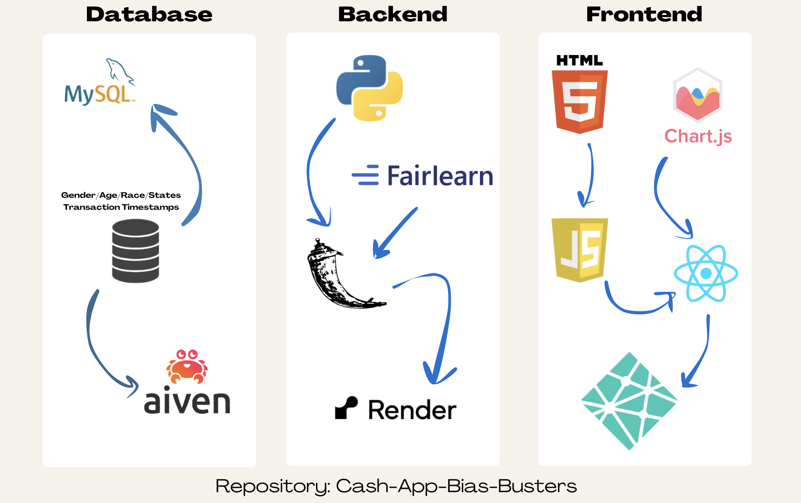

## Clean Architecture, Design Patterns and SOLID 
Our main `backend` functionality revolves around two folders `app` and `ml_model`. For both, we have used **Clean Architecture by Layer**. 

### backend/app
We have split up our `backend/app` into 5 folders (order below based on dependency level, the first being the highest level module):

### Clean Architecture:

- `entities` - defines core user data
- `infrastructure` - connects to the MySQL database
- `repositories` - implements interfaces inside use cases allowing for Dependency Injection
- `use_cases` - has code for all the use cases (split up into classes which follow SRP) which use some of the repository functions as helpers. Folder also contains the interfaces (which follow ISP)
- `controllers` - contains the Flask backend API

Our code is thus split up by layers to follow Clean Architecture. There are no dependency violations.

> *"This clean architecture by layer was verified by Prof. Paul when we spoke to him after our initial presentation."*

### Design Patterns:

- **Facade**: 
    - In `use_cases` we created multiple interfaces (which are implemented in `repositories`). So, instead of having just one class do everything, we split up our classes into smaller interfaces like - `DatabaseRepositoryInterface`, `FileRepositoryInterface`, `UserRepositoryInterface`. 
    - These interfaces act as a facade to the complex repository functions
    - This improves readability and makes it easier to test and implement new functionality 

- **Dependency Injection**: 
    - In the `use_cases` layer, classes depend on interfaces, not concrete implementations. Thus, `use_cases` does not know about the specific implementations in the `repositories` layer.
    - For example:
        ```
        from typing import Optional

        from backend.app.use_cases.DatabaseRepositoryInterface import DatabaseRepositoryInterface


        class GetLastLoginData:
            """
            A use case class to get the last login data from the database repository.

            Attributes:
                db_repo (DatabaseRepositoryInterface): An instance of the database repository interface.
            """

            def __init__(self, db_repo: DatabaseRepositoryInterface):
                self.db_repo = db_repo

            def execute(self) -> tuple[Optional[list[str]], Optional[dict[str, list[str]]], Optional[str]]:
                return self.db_repo.get_last_login_data()
        ```
    Here, `GetLastLoginData` relies on the         `DatabaseRepositoryInterface`, not on any specific repository class. The actual repository implementation (e.g., `SqliteDbRepo`) is injected at runtime.
    - This ensures that the `use_cases` layer remains agnostic to specific database or framework implementations thereby following clean architecture
    - This also allows for flexibility as we can change the functionality of the `use_cases` layer by just changing the `repositories` layer
    - It also makes testing easier as mock implementations of interfaces can be injected into `use_cases` which helps in isolating and testing individual layers

> *"These design patters were verified by Prof. Paul when we spoke to him after our initial presentation."*
> 
### SOLID Principles:
#### Single Responsibility Principle

Each class or module in our application has one clear responsibility:

- `entities`: Defines core user data without being concerned about database operations or API logic.
- `infrastructure`: Handles database connections and infrastructure setup.
- `repositories`: Implements specific data access methods and separates them into individual interfaces like `DatabaseRepositoryInterface`, ensuring modularity.
- `use_cases`: Each use case is encapsulated in a dedicated class (e.g., `GetLastLoginData`) with a single responsibility, such as fetching the last login data.
- `controllers`: Focuses solely on handling HTTP requests and responses, delegating business logic to the `use_cases`.
    
This clear separation ensures that changes in one layer (e.g., database schema changes) do not affect other unrelated layers.

#### Open/Closed Principle
Classes and modules are open for extension but closed for modification:

- Adding new functionality to `use_cases` does not require modifying existing classes. For instance, to add a new repository method, we extend the interface or create a new one rather than altering existing implementations.
- In `repositories`, implementations like `SqliteDbRepo` can be swapped or extended without affecting the use_cases layer, which depends only on interfaces.

#### Liskov Substitution Principle
Derived classes or implementations can be used interchangeably without altering the correctness of the program:

- Any implementation of `DatabaseRepositoryInterface` (e.g., `SqliteDbRepo`) can be substituted into a use case like `GetLastLoginData` without requiring changes to the `use_cases` logic.
- This is achieved by adhering to the contract defined by the interfaces, ensuring consistent behavior across implementations.

#### Interface Segregation Principle
Large interfaces are avoided by splitting them into smaller, focused ones:

We created multiple interfaces in the `use_cases` layer, such as:
- `DatabaseRepositoryInterface` for database operations.
- `FileRepositoryInterface` for file handling.
- `UserRepositoryInterface` for user-specific operations.

Each use case depends only on the methods it requires, ensuring that no class is forced to implement methods it does not use.

#### Dependency Inversion Principle
High-level modules do not depend on low-level modules; both depend on abstractions:

- `use_cases` depend on interfaces. For example, the `GetLastLoginData` use case depends on `DatabaseRepositoryInterface`, not on a concrete implementation like `SqliteDbRepo`.
- `repositories` implement interfaces. The actual implementation (e.g., `SqliteDbRepo`) adheres to the interface contract and is injected into `use_cases` at runtime.

This inversion ensures that `use_cases` are agnostic to changes in database technology or other low-level details.

> *"DIP was verified by Prof. Paul when we spoke to him after our initial presentation."*


### backend/ml_model

We have split up our `backend/ml_model` into 5 folders (order below based on dependency level, the first being the highest level module):

- `entities` - defines data points for graph display
- `infrastructure` - creates the data points
- `utility` - has helper functions for repositories
- `repositories` - implements interfaces inside use cases allowing for Dependency Injection
- `use_cases` - has code for all the use cases (split up into classes which follow SRP) which use some of the repository functions as helpers. Folder also contains the interfaces (which follow ISP)


`backend/ml_model` follows the same Design Patterns and SOLID principles as `backend/app` but with a different set of interfaces
- `DataProcessorInterface`
- `FileReaderInterface`


### frontend
Our frontend is organized into a clear folder structure to improve readability, maintainability, and scalability. Below is an overview of the structure:

```
frontend/
├── public/                  # Public assets (e.g., index.html, icons)
├── src/                     # Source code for the React application
│   ├── app/                 # Core application logic and configurations
│   ├── components/          # Reusable UI components
│   ├── layout/              # Layout-related components (e.g., header, footer)
│   ├── pages/               # Application pages
├── tests/                   # Frontend test scripts (using RTL and Jest)
├── .env                     # Environment variables
├── package.json             # Dependencies for the documentation
```

Additionally, each page in our dashboards has been split up into reusable components to minimize code duplication and eases making changes to particular components.


- ⁠Clean Architecture Explanation with both of our diagrams (architectural and UML) -- this high-level architectural diagram was created using `Pylint` for each of the classes. Note that there are 2 interfaces in the use case interactors section, _**we adapted our diagram and code structure based on what we discussed with Professor Paul and this is what he suggested.**_

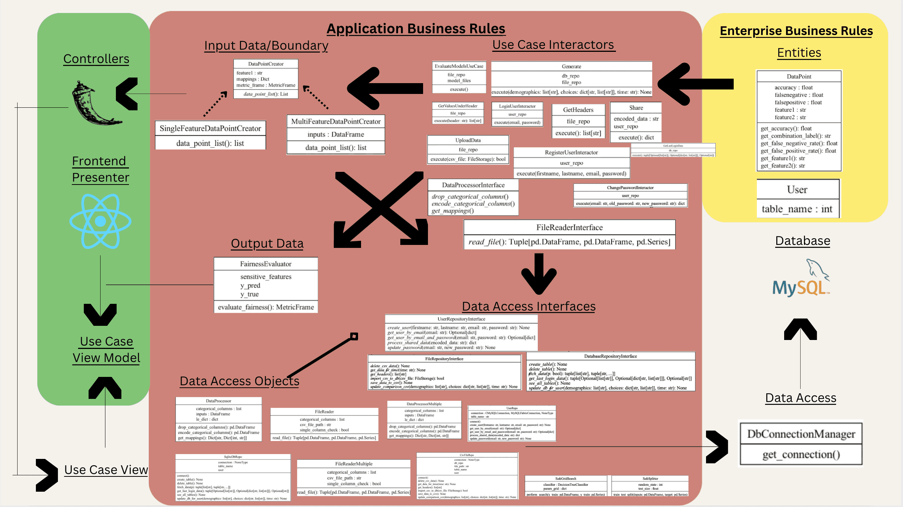

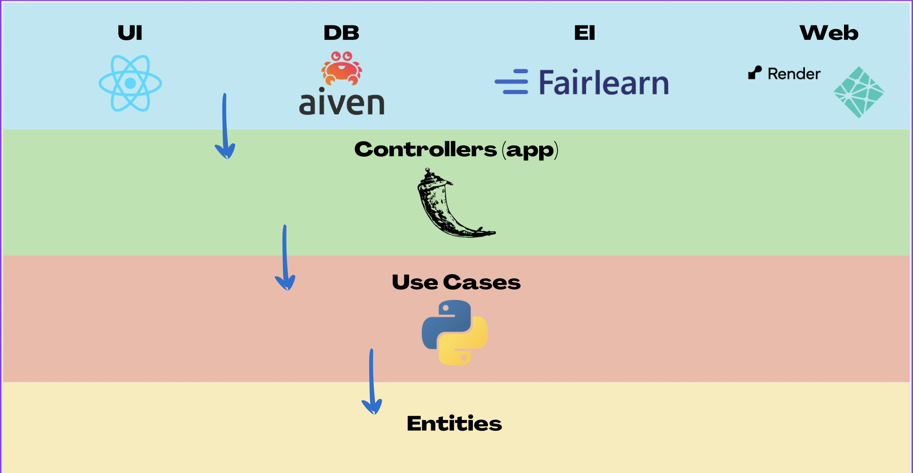

In the above image, as said, we adapted our use cases to follow the DIP as we had our repos dependent on them but this was modified and corrected. 

**Below is a group of images you don't need to read, they're general UML diagrams to show how we structured our classes**
Also generated with `Pylint` so some of these screenshots look generally bad. 
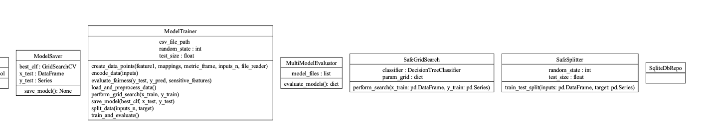
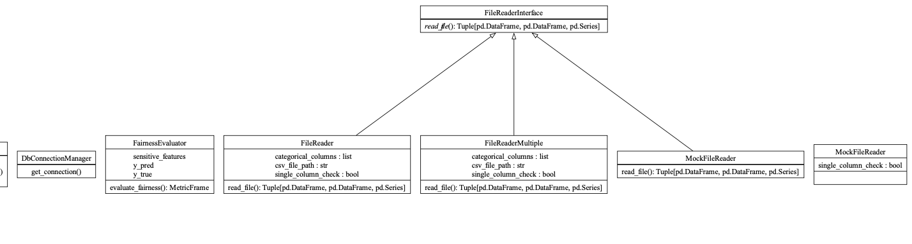
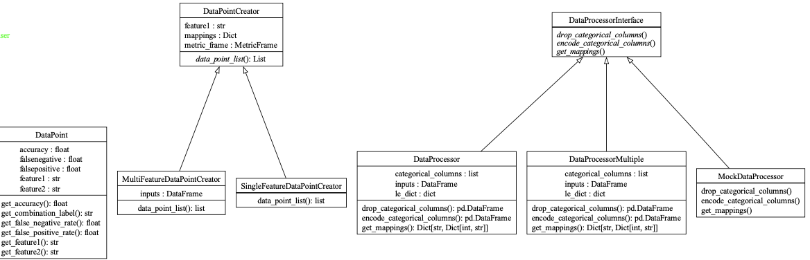
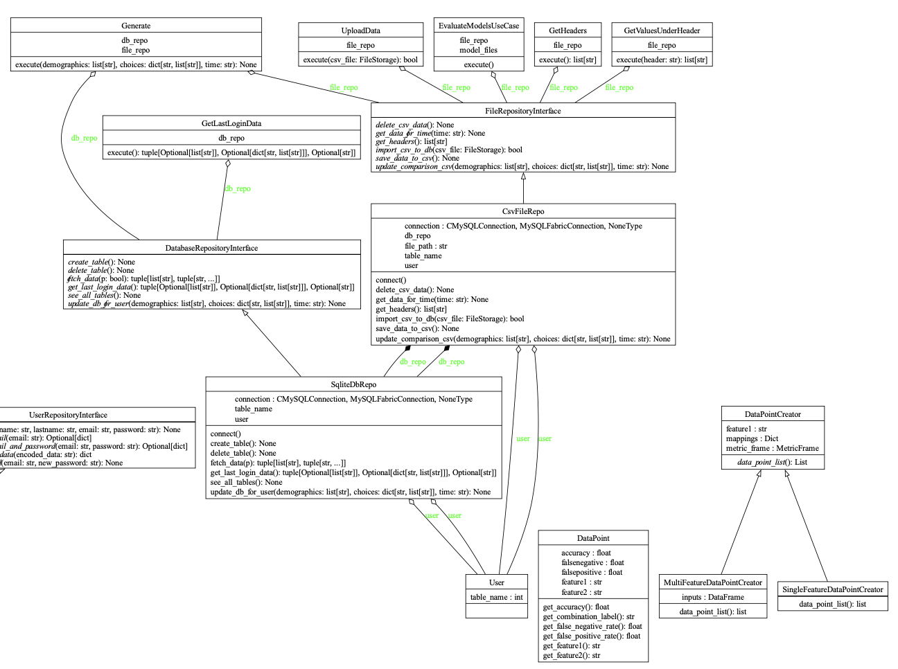
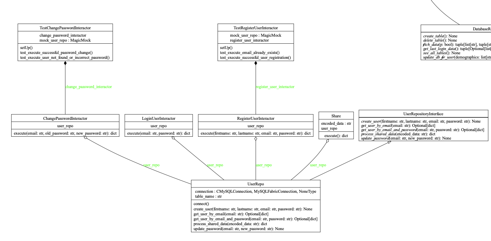
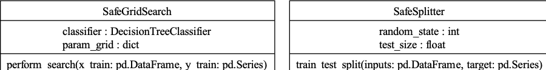

> **NOTE:** All images are available in the `supplementary/images` folder for reference

## Testing and Code Quality

For testing, we set up our CI/CD pipelines with GitHub actions for backend and Netlify for frontend.

For our backend, we used pytest and unittest achieving a backend test coverage of **94%**.
> Since we ran tests on our whole backend folder, we got a coverage of 94% but this also includes the tests folder itself since its inside backend. If we do not include that folder, we get a backend testing average of 86%.

For frontend testing, we used React Testing Library (RTL) and Jest achieving an overall frontend coverage of **46%**.

**We have made a short video of us running the tests for reference:** [Watch the Video](https://github.com/Jai0212/Cash-App-Bias-Busters/raw/main/supplementary/videos/tests.mp4)


To run backend tests:
```
pytest --cov=backend --cov-report html:cov_html
open cov_html/index.html
```

To run frontend tests:
```
cd frontend
npm test -- --coverage
```

This is the report of our backend coverage: 

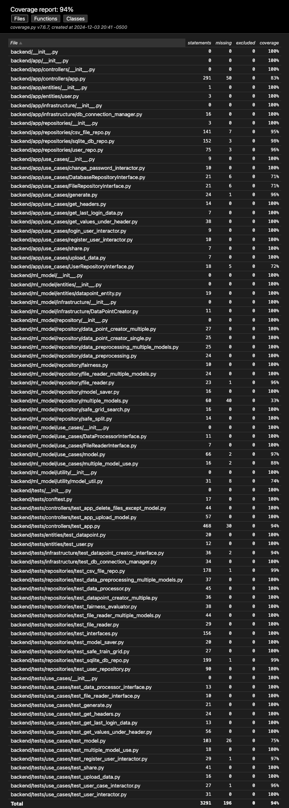

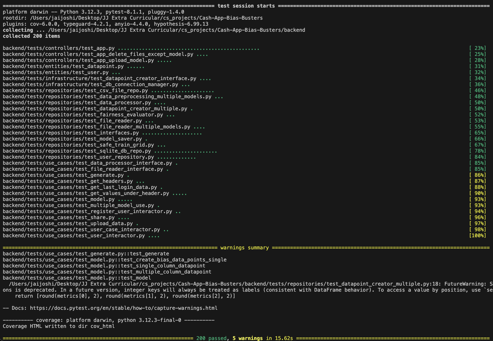


This is the report for our frontend coverage:

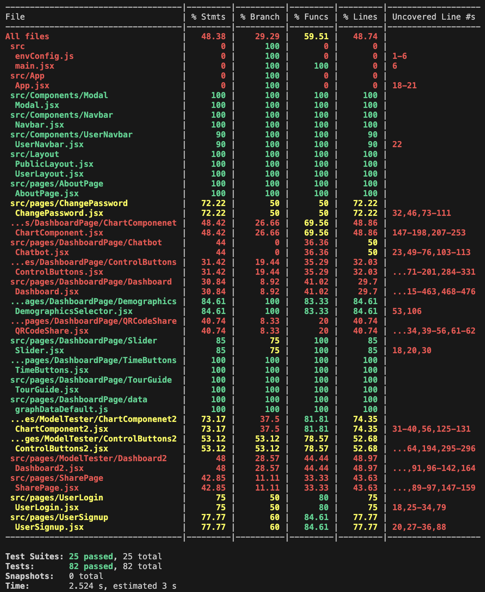


We also prioritized code quality by using pylint to eliminate linting errors, ensuring clean and maintainable code. The codebase is well-organized into appropriate folders, making it easy to navigate and scalable for future development.


## Accessibility
Our website follows the accessibility guidelines outlined during lectures and tutorials. Moreover, our components are inline with Web Content Accessibility Guidelines. Thus, our buttons and various components have formatted focus and hover states, and they are contrasting the background to make the website for the visually impaired.
 
Additionally, although challenging, we managed to incorporate accessibility into our graph as well by allowing users to tab into the bars of the graph. Thus, our graph and and components follow logical tab order. 

Furthermore, we have added focus for each tabbed button so if you tab onto a button, it will highlight into a different/brighter colour. 

#### According to the Web Content Accessibility Guidelines (WCAG), we have followed their **POUR** principles as extensively as possible. 

**Perceivable:** Our UI and components such as the graph are accessible in multiple ways. Using the tab order, and built-in features on computers, the data shown on our graphs can be perceived through voice commands. 

**Operable:** Our target audience for this project is CashApp machine-learning engineers so we believe that any engineer has the ability to interact with our interface and navigate our website. 

**Understandable:** We have added explanations for all of our content through buttons with question marks and our joyride features. All the buttons are made accessible with tab-ordering as mentioned. 

**Robust:** Although our target audience is CashApp ML engineers, we have also made our product understandable and interpretable by a wide range of users. Given the user understands the use of our website which we have explained in the readME, and has an ML model to upload, the user will be able to understand and interpret all the data on our website. We have added tutorial features, information buttons and extra information throughout our dashboards and about us pages. 
> **NOTE**: if you've clicked on other buttons before using the tab order (not the case for an actual user with accessibility issues) then it won't seem like it is logical order. So if you refresh our website and reuse it with the tabbing features, then it should be in logical tab order. 

Source: https://allyant.com/4-principles-of-web-accessibility/?gad_source=1&gbraid=0AAAAAD83oKhd27GijVdruxg0sWdrHcI49&gclid=CjwKCAiA9bq6BhAKEiwAH6bqoDCmKrvXiCfgKq3dhYXFEk-TmTOC27269zdUTiumDJ9tFIFoK8mlxRoCTUAQAvD_BwE

Here are some of our lighthouse accessibility reports:

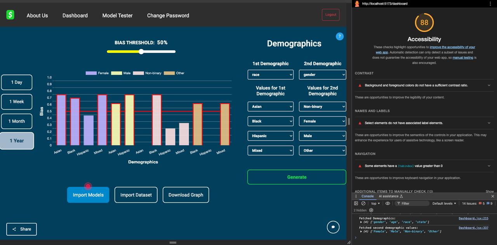
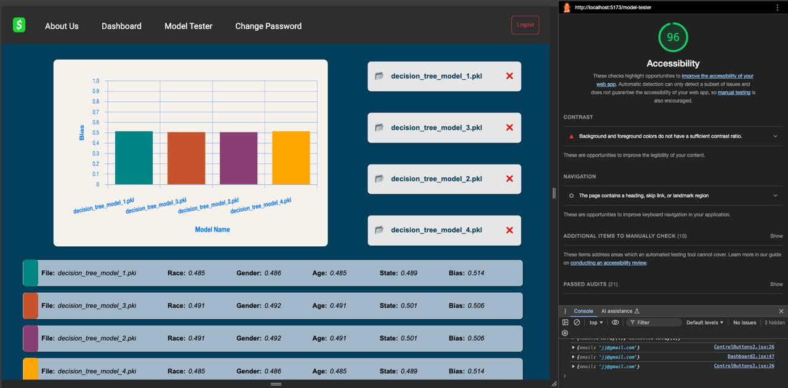


## How to use

We have sent the models and the dataset to Callum, along with the data that is meant to go in the .env files for security purposes.

### Steps to run locally

Before setting up the project, ensure your system meets the following requirements:

- **Operating System**: Windows 10/11, macOS 11+, or Linux (Ubuntu 20.04+ recommended)
- **Node.js**: Version 16.x or higher
- **Python**: Version 3.9 or higher
- **MySQL**: Version 8.0 or higher (for local database setup)
- **Browser**: Latest versions of Chrome, Firefox, or Edge
- **Package Manager**: npm or yarn

1. Clone the repository:
```
git clone https://github.com/Jai0212/Cash-App-Bias-Busters.git
```

2. Backend:
```
pip install -r backend/requirements.txt
python3 -m backend.app.controllers.app
```

3. Frontend
```
cd frontend
npm run dev
```

Make sure to put the respective env variables in the .env files. (this is in the message we sent to Callum)


### Steps to run on hosted

- [**Frontend**](https://cash-app-bias-busters.netlify.app/) - https://cash-app-bias-busters.netlify.app
- [**Backend**](https://cash-app-bias-busters.onrender.com/) - https://cash-app-bias-busters.onrender.com

> **NOTE**: Since we are using the free service of Render, our backend hosting is very slow causing delayed loading for components. So, please wait for a while if things don't load.

**We have made a short video on how to use the hosted app for reference:** [Watch the Video](https://github.com/Jai0212/Cash-App-Bias-Busters/raw/main/supplementary/videos/demo.mp4)

- Open the [backend link](https://cash-app-bias-busters.onrender.com/) first and let it load for about a minute (until it loads)
- Open the [frontend link](https://cash-app-bias-busters.netlify.app/) and create a new account

#### Dashboard 1:
Once logged in, import the model and the dataset we sent on mail. Select the demographics of your choice and click "Generate"

#### Model Tester (Dashboard 2):
Click on "Upload Models" and upload all the models we sent on mail and it will generate the results automatically

>You may wish to not create an account and use the credentials below to directly log in where the dataset and models are already uploaded and saved:
_**Email**: demo@gmail.com_  
_**Password**: demo_

>**NOTE**: You can find the models and the datasets in the message we sent to Callum

## Other
- ⁠**Challenges We Faced:**
    * Removing NodeJS modules: we could/should not have had them hosted. Overcame this by configuring our app package to handle the work we needed from Node modules
    * Working in branches: Initially, our branches fell behind the main branch often so we decided to stop working on them but realized that just caused more problems in terms of conflicting code within the main branch. After meeting with the TAs, we quickly overcame the issue and understood how to utilize branches and PRs and since we had a 2nd dashboard to develop, we got our numbers and contributions up. 
    * Maintaining 2 dashboards: our MVP only had the one dashboard which we initially prompt the user to upload their models and dataset but after our MVP presentation, Julie suggested we also implement a dashboard where the user can test their model(s) on existing data which we then worked quickly to create. One thing we noted was how much easier adhering to Clean Architecture and SOLID principles made it for us to develop the backend for the 2nd dashboard as we just extended classes using the OCP and most classes followed SRP so we understood all we needed to implement. 
    * Division of work: our group had not tracked contributions or work done by everyone by making tickets and issues in the Kanban board which led some of our group members to fall short in commits and contributions to the whole project. Since we had another dashboard to develop after we identified this issue, we were able to delegate work accordingly and managed to equalize contributions.         
- _⁠**How we split up work:**_ Overall, we split work up based on our strengths which we discussed within one of the first meetings we had as a group
    * **Akshat**: Backend (making `model.py` and making `multiple_model_use.py` for backend for 2nd dashboard, clean architeture refactoring and full `ml_model` package testing suite). I designed all of the presentation, used `Pylint` to create UML diagrams, made clean architecture diagrams, flow for our presentation (rough script).  
    * **Armagan**: Backend (making `model.py`, repositories layer and helper methods in that folder,   `Fairlearn` library and bias calculations/data cleaning, `ml_model` folder refactoring/SOLID implementation) Frontend (`Dashboard2`, `Dashboard.jsx`, `Modal.jsx`, helped with Chart.js work, CSS for most of the pages like Log in - Sign up - Dashboard2 - Upload Models Page)
    * **Batuhan**: Accessibility & Frontend. Overlooked high-level UI components. Designed the component layout of Dashboard 1 with CSS Flexible Box Layout. Implemented accesibility by adding appropriate contrast to buttons. Designed focus and hover states for components. Designed a custom wrapper for `Chart.js` to enable tab order into the graph.
    * **Jai**: Backend (`backend/app` folder with all database interaction, storing & fetching user data, etc), passing appropriate data to `backend/ml_model` via `output.csv`. Flask backend API and API calls in frontend. QR Code functionality in `frontend` and `backend`. Testing for backend, hosting and CSS.
    * **Navnoor**: Backend (`app.py` for login and signup functionality, database handling for users). Frontend (Worked on Dashboard components like `slider`, `ChartComponent`, `ChatBot`, etc). Helped in Unit Testing for backend and frontend.
    * **Virat**: Frontend (Implemented the charts for dashboard 1 & 2 using `Chart.js`, Implemented the other react components like TimeFrame buttons, Control Buttons etc, Worked on CSS and syling, and Wrote unit tests for the frontend components using `Jest` and `RTL`)
- ⁠Some decisions we made and why
- ⁠**Security Measures:** Security was a big concern for Julie and as we presented, everything the user inputs such as datasets are all filtered into output.csv based on demographic choices and after each generation of the graph, it is immediately deleted. 
- ⁠**Abnormalities:** We faced some issues getting smaller tasks done such as CSS which group members had to spare their own time to account for others' work. We have made you (the TAs) aware of this from before but we hope everything for smaller tasks such as CSS is complete and accessibility is up to par by the time we submit, as those were the tasks we faced trouble with. 

## Individual PRs
- ⁠Akshat: https://github.com/Jai0212/Cash-App-Bias-Busters/pull/60
    * Everything regarding Clean Architecture and SOLID principles is described within the PR. SRP/OCP principles are mainly highlighted, extended classes rather than modifying, Clean Architecture highlighted as the one of the main reasons functionality was easy to implement for the 2nd dashboard. Strategy and adapter design patterns utilized.     
- Armagan: https://github.com/Jai0212/Cash-App-Bias-Busters/pull/111
    * The PR follows Clean Architecture and SOLID principles by refactoring the helper functions into their own classes, following the SRP. This allowed me to clean out unnecessary logic out of `model.py` and significantly reduce the noise in that file by also creating a utilities file.
    *  In addition, abstract classes/interfaces for classes that handle a single or more than one instance of an event are implemented (for example: `file_reader`  and `file_reader_multiple_models` following the `FileReaderInterface`). This follows the OCP as new functionality can be built upon that without modifying existing classes. Also, making sure that no function in my interfaces are irrelevant to the multiple/single class follows from the ISP so that those classes don't have to implement functions they won't need/don't make sense.
- Batuhan: The PR for the Kanban ticket: [[PR]](https://github.com/Jai0212/Cash-App-Bias-Busters/pull/72) [[Kanban Ticket]](https://github.com/users/Jai0212/projects/2/views/1?pane=issue&itemId=87496046&issue=Jai0212%7CCash-App-Bias-Busters%7C69)

    * Since I've been the sole contributor to my individual Kanban ticket, this PR briefly explains what has been implemented. However, the Kanban ticket clearly outlines how and why the feature that is needed has to be implemented following the outline that TAs provided us with on Discord. The ticket highlights user story elements of *target audience, application, and user impact.*
    * I solved this ticket by unifying the respective hover and focus states of components. The reactive elements also have been color coded according to the guidelines of accessibility covered in lectures. Moreover, appropriate comments have been added to the changes to make sure all teammates had adequate knowledge of the current changes/state of the frontend.

- Jai: https://github.com/Jai0212/Cash-App-Bias-Busters/pull/99
    * The PR introduces the functionality of a new QR code generator and a new page. To achieve this, I created a new use case and added a function to the existing `UserRepositoryInterface`. This approach allowed me to extend the functionality without modifying the existing codebase, following SRP to keep responsibilities focused. OCP was applied by adding new features without altering core logic.
    * I used DIP to ensure the use case depended on the interface rather than a concrete implementation, making testing easier. ISP was followed by keeping the interface focused on the required functionality. The Facade Pattern simplified integration, and DI allowed seamless addition of the QR code functionality by having the `repositories` layer implement the interface. This ensured that the new feature could be added through the repository layer, keeping the code modular, maintainable, and testable.

- Navnoor: https://github.com/Jai0212/Cash-App-Bias-Busters/pull/93
     * The PR description highlights the use of Clean Architecture and SOLID principles. In brief, to refactor the user interactor logic, I split the existing interactor file into three class-based implementations, each with a single responsibility. These implementations are encapsulated in separate files: register_user_interactor.py, login_user_interactor.py, and change_password_interactor.py.
  * The implementation follows SOLID principles to ensure modularity, scalability, and maintainability. Each interactor is encapsulated in its own class with an execute() method to handle specific functionalities like user registration, login, and password updates.

- Virat: https://github.com/Jai0212/Cash-App-Bias-Busters/pull/101
    - The PR demonstrates CLEAN Architecture and SOLID principles by refactoring timeframe button logic into a new `TimeButtons` component, adhering to SRP and OCP for better modularity and maintainability. A separate CSS file was added for styling, and manual testing ensured functionality. More details are in the PR description.

## Special Thanks
We wanted to express our gratitude for the TAs in this short message. Every meeting we've had with you guys has been constructive and we were only able to progress through each week of deliverables and all our tasks because we had your help. We're really thankful for how much time you've committed to helping us and your patience with our group as we faced internal/external issues. We couldn't have finished this project without your help so thank you so much!
